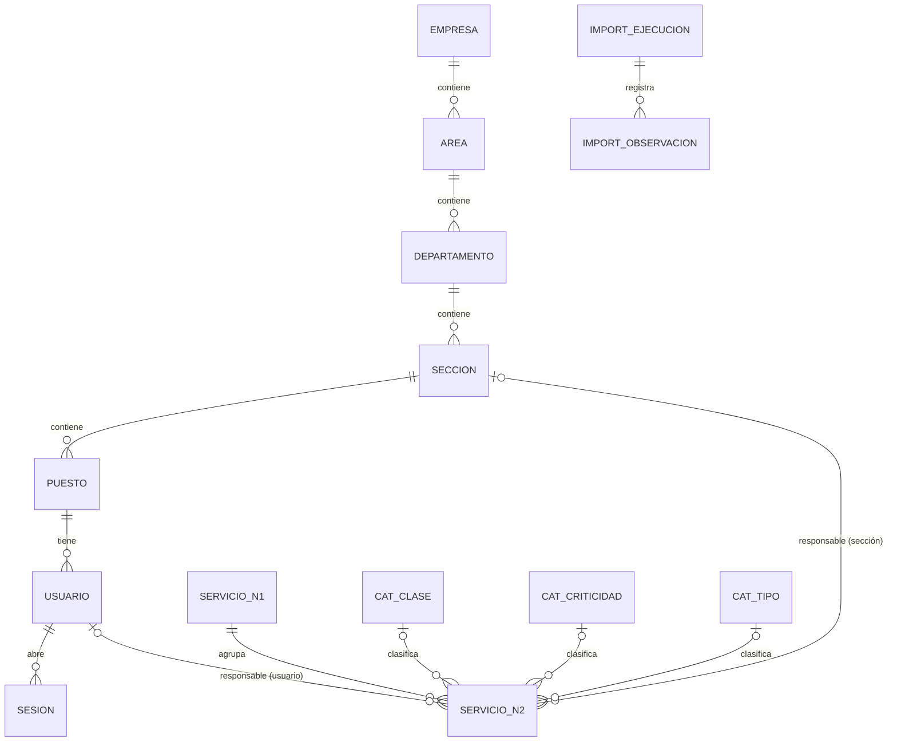

# Resolución del parcial — Sistema de gestión del catálogo de servicios de TI

**Asignatura:** Software Avanzado · **Estudiante:** _(completar)_ · **Carné:** _(completar)_ · **Fecha:** 04/10/2026

## 1. Problema, alcance y supuestos
Sistematizar el catálogo de servicios de TI (hoja «Servicios Externos» del Excel) en una aplicación web con autenticación local, base de datos persistente,
estructura organizacional y asignación de responsables, ejecutable con `docker compose`. No incluye tickets, facturación ni consumo.

Supuestos y decisiones: (1) `ACTIVO` del Excel se conserva como indicador S/N/desconocido (`indicador_activo`) y es **distinto** de la baja lógica del sistema (`activo`);
(2) todo usuario pertenece a un puesto (la empresa se deduce de la jerarquía); (3) la baja lógica **bloquea** si hay dependientes activos; (4) el Excel se trata como fuente de datos, nunca como instrucciones;
(5) los atributos de clase/criticidad/tipo/métrica/umbrales pertenecen al **servicio de nivel 2** (los N1 solo tienen código y nombre).
Relación con el material del curso (ITIL): el «dueño del servicio» corresponde al usuario responsable asignado a cada servicio N2 y la «categorización» a los catálogos clase/criticidad/tipo.

## 2. Arquitectura y justificación de tecnologías
| Capa | Tecnología | Justificación |
|---|---|---|
| Web | Python 3.12 + Flask 3, plantillas Jinja (HTML en servidor), gunicorn | Simple, auditable; la autorización vive en el servidor; sin dependencias de front-end. |
| Datos | PostgreSQL 16 (Docker, volumen `pgdata`) | Preferencia del enunciado; restricciones UNIQUE/FK/CHECK. |
| Acceso | SQL portable con adaptador propio (`db.py`), sin ORM | Permite ejecutar las mismas consultas en PostgreSQL y en SQLite (pruebas rápidas del asistente). Transacciones explícitas. |
| Seguridad | scrypt (Werkzeug) + sesiones en BD + CSRF HMAC | Ver §5. |
| Importación | `openpyxl` (solo lectura) | Acceso a rangos combinados. |
| Despliegue | Dockerfile + `compose.yaml` (db, app, tests) | Healthcheck de `db`, `depends_on: service_healthy`, migraciones al arrancar. |

## 3. Modelo de datos

**Diccionario (resumen).** Todas las claves primarias `id` son enteros autogenerados.
| Tabla | Campos principales | Claves / restricciones |
|---|---|---|
| `empresa` | codigo, nombre, activo | `codigo` UNIQUE |
| `area` / `departamento` / `seccion` / `puesto` | codigo, nombre, activo, FK al padre (`empresa_id`, `area_id`, `departamento_id`, `seccion_id`) | FK NOT NULL (sin huérfanos); UNIQUE (padre, codigo) |
| `usuario` | nombre, login (usuario o correo, minúsculas), password_hash, rol, activo, puesto_id, creado | `login` UNIQUE; CHECK rol ∈ {administrador, consulta}; FK `puesto_id` NOT NULL |
| `sesion` | token_hash (SHA-256), usuario_id, creada, expira | PK `token_hash`; FK usuario |
| `cat_clase`, `cat_criticidad`, `cat_tipo` | nombre, orden | `nombre` UNIQUE |
| `servicio_n1` | codigo, codigo_original, nombre, activo, estado_revision, nombres_alternos, origen_hoja/rango/json, transformaciones | `codigo` UNIQUE |
| `servicio_n2` | codigo, codigo_original, nombre, nivel1_id, indicador_activo, clase_id, criticidad_id, tipo_id, descripcion, metrica, minimo, maximo, activo, seccion_id, usuario_id, estado_revision, nombres_alternos, origen_*, transformaciones, creado, actualizado | `codigo` UNIQUE; FK nivel1 NOT NULL; FK catálogos/sección/usuario NULL; CHECK `minimo IS NULL OR maximo IS NULL OR minimo <= maximo` |
| `mapeo_etiquetas` | campo, valor_origen, valor_destino, motivo | UNIQUE (campo, valor_origen) |
| `import_ejecucion` / `import_observacion` | archivo, sha256, estado, resumen JSON / tipo, código, hoja, rango, detalle | FK ejecución |

## 4. Mapeo Excel → base de datos y tratamiento de calidad
| Columna | Campo | Tratamiento |
|---|---|---|
| A, B | COD.N1, SERVICIO - Nivel 1 | `servicio_n1.codigo` / `nombre` (valor de la celda principal del rango combinado) |
| C, D | COD.N2, SERVICIO - Nivel 2 | `servicio_n2.codigo` / `nombre`, enlazado a su N1 |
| E | ACTIVO | `indicador_activo` (S / N / otro valor conservado / NULL = desconocido) |
| F, G, H | CLASE, CRITICIDAD, TIPO | FK a catálogos; si difiere solo en mayúsculas/espacios se normaliza y se registra en `mapeo_etiquetas`; si no existe en el catálogo → NULL + observación (original en `origen_json`) |
| I, J | Descripción, Métrica | texto (descripción multi-fila se concatena) |
| K, L | Minimo, Maximo | `DOUBLE PRECISION` o NULL (**nunca 0**); si mín > máx → ambos NULL + observación |
| — | Trazabilidad | `origen_hoja`, `origen_rango` (p. ej. `A5:L7`), `origen_json` (filas y valores crudos), `transformaciones`, `codigo_original` |

**Resultado sobre el archivo real** (`docs/evidencias/importacion_excel_real.txt`): 12 N1 y 46 N2 (controles OK), 97 filas leídas, 4 observaciones.
1. **Celdas combinadas:** valor de la celda principal; un servicio = un registro aunque ocupe varias filas (p. ej. `C5:C7`). No se propaga fuera del rango.
2. **SE.12 (filas 99–100):** un único registro. Nombre canónico **«Suministrar Analitica»** (primera aparición, fila 99). Justificación: «Mantener Tableros de Control» es el nombre del N2 `SE.12.3` (D101), por lo que B100 parece un valor desplazado. Ambos valores quedan en `nombres_alternos`/`origen_json` y en la observación `CONFLICTO_NOMBRE_N1`; el N1 queda en `REVISION`.
3. **Códigos:** `SE.12.1…3` y `SE.01.01…` se conservan como texto; solo se recortan espacios (si ocurriera, se registra en el mapeo).
4. **Atributos incompletos (99–101):** NULL + `estado_revision = REVISION`; no se inventa clase, criticidad, tipo, métrica ni activo.
5. **Filas de continuación:** 42 y 67 (atributos sin código, fuera de combinación) → `FILA_SIN_CODIGO`, no se asignan. La fila 101 sin N1 → `N1_DERIVADO` desde el prefijo `SE.12`. Las listas `E112:H122` se leen y contrastan con el enunciado (el rótulo «OPCIONES» está en la fila 111).
6. **Trazabilidad:** cada ejecución guarda archivo, SHA-256, resumen y observaciones (pantalla «Importaciones»). Reimportar: 0 creados / 0 actualizados / 58 omitidos; conserva asignaciones y bajas lógicas.
Reporte por ejecución: creados, actualizados, omitidos, observados (códigos con observaciones) y controles 12/46.

## 5. Autenticación, autorización, contraseñas y sesión
- **Login local** con usuario o correo (insensible a mayúsculas) y contraseña contra la tabla `usuario`; sin proveedores externos. Respuesta idéntica para usuario inexistente, contraseña errónea o cuenta inactiva (y se verifica un hash falso para igualar tiempos).
- **Contraseñas:** `scrypt` con sal aleatoria por contraseña (Werkzeug); mínimo 8 caracteres. Hay una prueba que comprueba que no se guarda en claro y que dos usuarios con la misma clave tienen hashes distintos.
- **Sesión en servidor:** cookie `sid` (HttpOnly, SameSite=Lax; `Secure` configurable) con token aleatorio; en BD solo se guarda su SHA-256. Se invalida al cerrar sesión, al desactivar al usuario, al cambiar su contraseña y al expirar (8 h).
- **Autorización:** `login_requerido` / `admin_requerido` en el servidor. `consulta` solo lee (403 en cualquier escritura); ninguna vista expone `password_hash`.
- **CSRF:** token HMAC ligado a la sesión, exigido globalmente en toda petición POST (salvo el login, que aún no tiene sesión). Redirección post-login restringida a rutas internas.
- **Protecciones de dominio:** no se puede desactivar la propia cuenta ni al último administrador ni quitarle el rol.
- **Cuentas de evaluación:** `python -m catalogo.cli cuentas` con credenciales de `.env` (demostración, sin secretos reales en Git).

## 6. Evidencias de las tres técnicas (separadas)
- **Context engineering:** [`AGENTS.md`](../AGENTS.md), [`docs/contexto/`](contexto/) — índice por fase, análisis del Excel, reglas, regla de datos no confiables y **dos actualizaciones** justificadas ([03](contexto/03-actualizaciones-de-contexto.md)).
- **Prompt engineering:** [`docs/prompts/registro-prompts.md`](prompts/registro-prompts.md) — prompts reales con dos iteraciones; el registro **indica qué falta por completar por el estudiante** (no se inventaron).
- **Harness engineering:** `scripts/verificar.sh`, `scripts/p12_persistencia.*`, perfil `test` de compose, límites en `AGENTS.md` §4 y [ciclo de corrección real](evidencias/harness-ciclo-correccion.md).
- _Enlaces a commits:_ completar con los SHA tras subir a GitHub (`git log --oneline`).

## 7. Matriz requisito → implementación → prueba → evidencia
| Requisito | Implementación | Prueba (nivel) | Evidencia |
|---|---|---|---|
| Login/logout local, hash con sal (3.1) | `security.py`, `vistas/auth.py` | P01, hash/sal/token (integración) | `pruebas_local_sqlite.txt` |
| Rutas protegidas, sesión, inactivo (3.1) | `login_requerido`, `usuario_de_token` | P02 ×3, sesión expirada (integración) | ídem |
| Roles admin/consulta (3.1) | `admin_requerido`, 403 | P03, sin hashes visibles (integración) | ídem |
| Jerarquía y usuarios (3.2) | `org.py`, `usuarios.py`, migración | P04 (E2E por HTTP), políticas de baja, huérfanos (unit/integración) | ídem |
| Duplicados/referencias (3.2, 3.3) | validaciones + UNIQUE/FK | P05 | ídem |
| Importación 12/46 (3.4) | `importador.py`, `cli.py` | P06 | `importacion_excel_real.txt` |
| Repetible sin duplicar (3.4) | `_upsert` por código | P07 | ídem |
| SE.12 y ausencias (3.4) | reglas §4 | P08 | ídem |
| min ≤ max, ausente ≠ 0 (3.3) | `servicios.py` + CHECK | P09 (unit + BD) | `pruebas_local_sqlite.txt` |
| Búsqueda, filtros, paginación, ficha (3.3) | `buscar_n2`, plantillas | P10 (unit + UI) | ídem |
| Responsable de la misma sección (3.3) | `validar_asignacion` | P11 (+ casos de inactivos y movimientos) | ídem |
| Persistencia al reiniciar (5) | volumen `pgdata` | P12 lógico (unit) + `p12_persistencia.sh` (E2E con Docker) | script + CHECKLIST |
| Docker reproducible (5) | `Dockerfile`, `compose.yaml`, `.env.example` | `verificar.sh` | §9 |

**Niveles:** *unitarias* (`org`, `servicios`, `usuarios` directamente), *integración* (cliente HTTP de Flask contra BD real, incl. CSRF y cookies) y *extremo a extremo* (P12 con contenedores reales). No hay pruebas de navegador.

## 8. Resultados reales de pruebas
| Comando | Fecha | Entorno | Commit | Resultado |
|---|---|---|---|---|
| `python -m unittest discover -s tests -v` | 04/10/2026 | SQLite local (entorno del asistente, **sin Docker**), Excel real | _(sin commit aún)_ | `Ran 45 tests … OK (skipped=1)` — [`pruebas_local_sqlite.txt`](evidencias/pruebas_local_sqlite.txt) |
| mismo con `USAR_FIXTURE=1` (Excel de prueba) | 04/10/2026 | SQLite | — | `Ran 45 tests … OK` (la prueba omitida es específica del fixture) |
| `python -m catalogo.cli importar` ×2 | 04/10/2026 | SQLite, Excel real | — | 12 N1 / 46 N2; 2ª corrida 0 creados, 0 actualizados — [`importacion_excel_real.txt`](evidencias/importacion_excel_real.txt) |
| `docker compose --profile test run --rm tests` | _(completar)_ | PostgreSQL 16 en Docker | _(SHA)_ | _(pendiente: ejecutar en el equipo del estudiante y pegar resultado)_ |
| `bash scripts/verificar.sh` | _(completar)_ | Docker | _(SHA)_ | _(pendiente)_ |

**Fallos encontrados y correcciones:** (1) 5 pruebas con HTTP 500 por `csrf_token` no visible en macros → `import … with context` (ver [ciclo](evidencias/harness-ciclo-correccion.md)); (2) pruebas atadas a códigos concretos (`SE.01.1`) frente al Excel real (`SE.01.01`) → consultas dinámicas.
Los resultados contra PostgreSQL **no se han ejecutado todavía**: el entorno donde se construyó no tenía Docker; el código usa SQL portable y las pruebas están preparadas para ambos motores.

## 9. Docker, persistencia y recuperación
- **Servicios:** `db` (postgres:16-alpine, volumen `pgdata`, healthcheck `pg_isready`), `app` (gunicorn, `depends_on: service_healthy`, healthcheck en `/salud`, Excel montado en solo lectura), `tests` (perfil `test`, BD `catalogo_test`).
- **URL/puertos:** http://localhost:8000 (`APP_PORT`). PostgreSQL no se publica al host.
- **Versiones:** Docker 24+, Compose v2.20+. **Logs:** `docker compose logs -f app`.
- **Apagado normal:** `docker compose down` (conserva datos). **Reinicio destructivo:** `docker compose down -v` (borra el volumen).
- **Recuperación:** tras `down` + `up -d` los datos siguen; si los datos de evaluación se corrompen: `down -v`, `up --build -d`, `exec app python -m catalogo.cli demo`.
- El arranque espera a la BD (healthcheck + reintentos en `cli.py`) y aplica migraciones idempotentes.

## 10. Limitaciones, aportes y reflexión
**Limitaciones conocidas:** sin limitación de intentos de login ni política de complejidad de contraseñas más allá de la longitud; cookie sin `Secure` por defecto (HTTP local); interfaz funcional y sencilla (sin pruebas de navegador);
el nombre canónico de SE.12 es una decisión de criterio (documentada y reversible); `nombres_alternos` y `origen_json` se guardan como texto JSON; no hay migraciones de bajada; las pruebas contra PostgreSQL están pendientes de ejecutar (ver §8).

**Aportes:** trabajo individual. Estudiante: _(completar: decisiones, revisión del código, ejecución de pruebas en Docker, subida a GitHub)_. Asistente de IA: generación del código, pruebas y borradores de documentación bajo las reglas de `AGENTS.md`.

**Reflexión — errores de la IA y decisiones humanas:**
- *Errores de la IA:* confundió la zona horaria (UTC vs Guatemala); un primer intento de crear archivos falló por usar expansión de llaves en `sh` y hubo que rehacerlo; las plantillas fallaron por el contexto de macros Jinja; las pruebas iniciales asumían códigos que el Excel real no tiene; el diseño inicial suponía atributos E:H combinados y el archivo real los repite por fila.
- *Decisiones humanas:* exigir ejecución con Docker en el equipo del catedrático; aportar el Excel real; corregir la hora; revisar y aceptar (o cambiar) el criterio del nombre canónico de SE.12; completar con evidencia propia lo que la IA no puede certificar (ejecución en Docker, prompts propios, GitHub).
